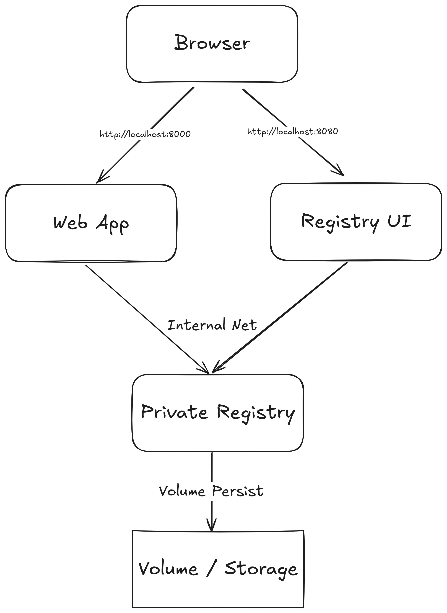
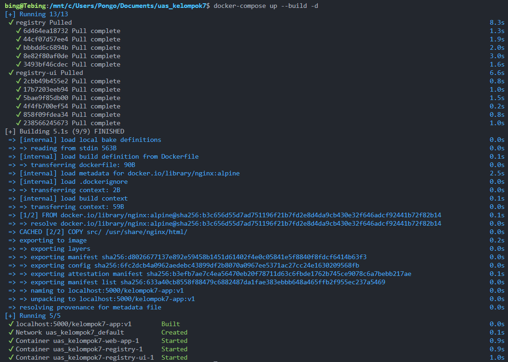
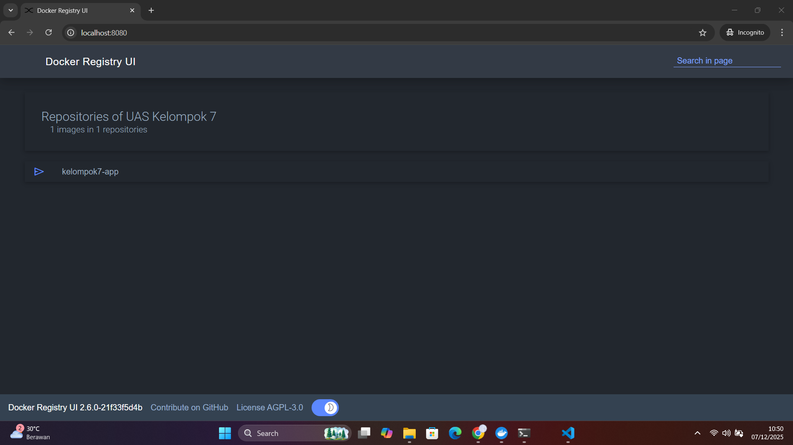
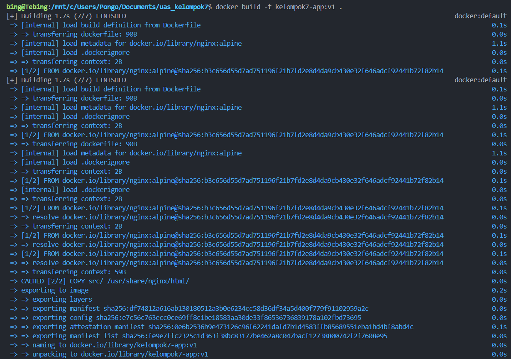
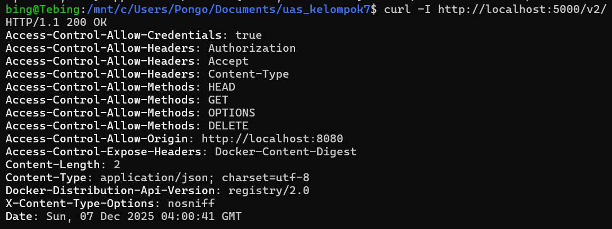

# Project UAS Sistem Operasi Kelompok 7 - Private Docker Registry + Web App

## • Kelompok 7

1. **Tebing Rizky Tsaniansyah** (2410501080)
2. **Heru Chandra** (2410501094)
3. **Muhammad Farrel Fauzan** (2410501092)
4. **Radinka Alifasya Dinova** (2410501073)
5. **Muhammad Ragil Hardika** (2410501103)

## • Tema Project

**Private Docker Registry** - Sistem untuk menyimpan dan mengelola Docker images secara lokal menggunakan Docker Registry dengan Web UI sebagai interface visual.

## • Layanan dalam Project

1. **Service 1** – Private Docker Registry (Port 5000)
   - Service backend untuk menyimpan dan mengelola Docker images secara lokal
2. **Service 2** – Registry Web UI (Port 8080)
   - Interface visual berbasis web untuk melihat dan mengelola image yang tersimpan di registry
3. **Service 3** – Sample Web Application (Port 8000)
   - Aplikasi web sederhana berbasis Nginx sebagai contoh workload yang dikelola dalam sistem

## • Arsitektur


**[Link Arsitektur Sistem](https://excalidraw.com/#json=gpy7-En-T_z1FiFjWk3vc,3Tu-lsh3UackSUmi1thCwQ)**

**Komponen Sistem:**

```
┌─────────────────────┐
│   Registry Web UI   │ (Port 8080)
│  joxit/registry-ui  │
└──────────┬──────────┘
           │
           ▼
┌─────────────────────┐
│  Docker Registry    │ (Port 5000)
│    registry:2       │
└──────────┬──────────┘
           │
           ▼
    ┌──────────────┐
    │ Volume Data  │
    │data_registry │
    └──────────────┘

┌─────────────────────┐
│   Web Application   │ (Port 8000)
│       Nginx         │
└─────────────────────┘
```

## • Cara Menjalankan

```bash
# 1. Clone repository dari GitHub
git clone https://github.com/tebing27/uas-sistem-operasi.git

# 2. Masuk ke direktori project
cd uas-sistem-operasi

# 3. Jalankan semua service (Registry, UI, dan Web App)
docker compose up --build -d

# 4. Build image aplikasi secara manual dengan tag lokal
docker build -t kelompok7-app:v1 .

# 5. Beri tag baru agar sesuai dengan alamat local registry (localhost:5000)
docker tag kelompok7-app:v1 localhost:5000/kelompok7-app:v1

# 6. Push image tersebut ke Private Docker Registry lokal
docker push localhost:5000/kelompok7-app:v1

# 7. Cek status container untuk memastikan semua berjalan
docker compose ps
```

**Akses layanan:**

- **Registry API:** http://localhost:5000
- **Registry Web UI:** http://localhost:8080
- **Web Application:** http://localhost:8000

## • Hasil Running

### Screenshot Docker Compose Up



### Screenshot Docker Registry UI



### Screenshot Docker Build



### Screenshot Docker Tag dan Push


### Screenshot Docker PS dan Logs


### Screenshot Web Application


### Screenshot CORS Configuration



## • Konfigurasi

### **Dockerfile**

Penjelasan konfigurasi Dockerfile untuk sample web application:

- Menggunakan base image `nginx:alpine` untuk efisiensi
- Menyalin file `index.html` dari direktori `src/` ke `/usr/share/nginx/html/`
- Nginx berjalan sebagai foreground process

### **docker-compose.yml**

Penjelasan konfigurasi docker-compose.yml:

**Service Registry:**

- Menggunakan image `registry:2`
- Port mapping `5000:5000`
- Volume untuk persistensi data di `./data_registry`
- Konfigurasi CORS dari file `registry-config.yml`
- Restart policy: `unless-stopped`

**Service Registry UI:**

- Menggunakan image `joxit/docker-registry-ui:main`
- Port mapping `8080:80`
- Environment variables untuk koneksi ke registry
- Enable delete images dan single registry mode
- Depends on: registry service

**Service Web App:**

- Build dari Dockerfile lokal
- Port mapping `8000:80`
- Image tag: `localhost:5000/uas_kelompok7:v1`
- Restart policy: `unless-stopped`

## • Kendala dan Solusi

### Kendala 1 → Solusi

**Masalah:** Error saat push image ke registry - "http: server gave HTTP response to HTTPS client"

**Solusi:**

- Mengonfigurasi Docker daemon untuk mengizinkan insecure registry
- Menambahkan `"insecure-registries": ["localhost:5000"]` di Docker Desktop Settings atau `/etc/docker/daemon.json`
- Restart Docker service setelah konfigurasi

### Kendala 2 → Solusi

**Masalah:** Registry Web UI tidak bisa menampilkan images karena CORS policy

**Solusi:**

- Menambahkan konfigurasi CORS di `registry-config.yml`
- Mengatur header `Access-Control-Allow-Origin` untuk mengizinkan request dari port 8080
- Mengatur `Access-Control-Allow-Methods` dan `Access-Control-Allow-Headers` yang diperlukan
- Restart registry service setelah konfigurasi

---
